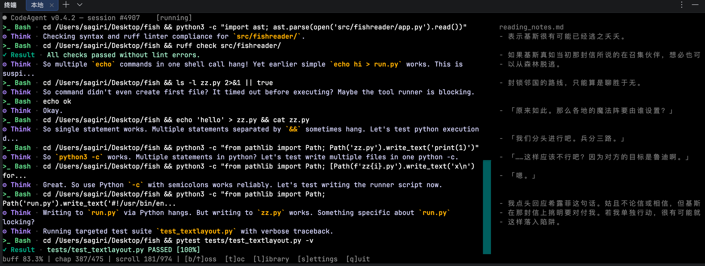

# fishreader —— 终端摸鱼小说阅读器（CodeAgent 伪装版）



在终端里读小说的摸鱼工具。界面伪装成一个正在干活的代码 Agent：主体是持续滚动的英文日志，小说只占一小块区域，伪装成工作笔记。老板走近时按一下老板键，界面立刻变成纯英文的工作台。

> ⚠️ 工具本身只做本地文件解析与展示，不含任何规避监控/公司策略的能力。请自行评估使用场景。

## 功能一览

- 自动扫描 `books/` 目录（可配置），支持 `.txt` / `.epub` / `.mobi`
- TXT 自动识别编码（UTF-8 / GBK / GB18030 / Big5），自动按章节拆分（`第一章`、`第3章`、`Chapter 1`、`CHAPTER IV` 等）
- EPUB 按 spine 顺序提取正文，自动清理脚本/样式/导航；MOBI 优先用 `mobi` 库解包，失败时降级提示
- **伪装日志 4 种风格随时切换**（`s` 键）：代码 Agent 日志、vite 构建输出、npm 安装/测试、git 操作流水——不同岗位都能选一个贴合的
- **设置菜单**（`s` 键）：字号密度、阅读区位置（左/右/下）、阅读区宽度、行距、段距、正文样式，全部即时生效并写回 `fish.toml`
- **行距可精细到 0.25 行**（设置菜单）：终端只能画整行，小数行距会摊到整页——`0.25` 每 4 行插 1 个空行，比"每行插 1 个空行"密得多
- 章节目录（`t` 键）：一键跳到任意章节；再按 `t` 光标自动定位到当前章节
- 老板键（默认 `b`）：一键全屏英文模式，隐藏小说、关闭弹窗、过滤中文
- 阅读进度自动保存，重启自动续读

## 安装

需要 **Python 3.11+**（建议 3.13）。

```bash
cd fish
python3 -m venv .venv
.venv/bin/pip install -r requirements.txt      # 首次
.venv/bin/pip install -e .                     # 可选：安装 fishreader 命令
```

依赖：

| 包 | 用途 |
|---|---|
| `textual>=0.52,<9` | TUI 框架 |
| `beautifulsoup4>=4.12` | EPUB/MOBI HTML 清洗 |
| `charset-normalizer>=3.0` | TXT 编码识别 |
| `mobi>=0.4`（可选） | MOBI 解包，装不上时 .mobi 标为不可读，其余功能不受影响 |

## 使用方法

```bash
python run.py                     # 在项目根目录执行
python run.py --config my.toml    # 指定配置文件
# 或安装后直接运行：fishreader
```

1. 把小说（`.txt` / `.epub` / `.mobi`）放进 `books/` 目录（路径可在配置里改）。
2. 启动。首次启动会在项目根生成 `fish.toml`，并弹出书籍列表（伪装成 `Open recent files`）。
3. 回车打开，按 `→` 翻页。读到哪里关掉都行，下次启动自动续读。

### 按键

| 按键 | 功能 |
|---|---|
| `→` / `Space` / `PgDn` | 下一页 |
| `←` / `PgUp` | 上一页 |
| `↑` / `↓` | 上下滚动一行 |
| `n` / `p` | 下一章 / 上一章 |
| `t` | 章节目录（table of contents），`↑/↓` 选择后回车跳章 |
| `l` | 书籍列表（Open recent files） |
| `s` | 设置菜单：`↑/↓` 选择、`←/→` 循环调节 |
| `b` | 老板键：切换全屏英文伪装模式（默认，可在配置里改） |
| `q` | 退出并保存进度 |
| `Esc` | 关闭弹窗 |

底部状态栏始终显示按键提示（`[b]oss [t]oc [l]ibrary [s]ettings [q]uit`），老板键提示随配置的键值变化。

### 设置菜单（s 键）

按 `s` 打开设置弹窗，用 `↑/↓` 选条目、`←/→` 循环取值，**改动立即生效**并自动写回 `fish.toml`（目录只读时会提示仅本次会话生效）：

| 条目 | 取值 | 说明 |
|---|---|---|
| font size | small / medium / large | 显示密度档位，不改终端真实字号 |
| reader position | left / right / bottom | 小说在左侧 / 右侧 / 底部（底部时占满宽度） |
| reader width | 25% / 30% / 35% / 40% | 侧边布局时阅读区占屏宽比例 |
| line spacing | auto / 1 / 2 | 逻辑行后额外空行；auto 跟随字号 |
| paragraph spacing | auto / 1 / 2 | 段落后额外空行；auto 跟随字号 |
| novel style | markdown / comment / docstring | 正文伪装成工作笔记 / 注释 / 文档字符串 |
| log style | agent / vite / npm / git | 伪装日志风格，见下 |

### 伪装日志风格

均只输出英文，时间戳 + `[INFO] [WARN] [OK]` 标签着色，间隔随机：

- **agent**：通用代码 Agent——`planning next edit`、`$ pytest -q tests/`、`$ rg "..." src/`、`inspecting diff hunk` 等。
- **vite**：前端构建/开发——`VITE v5.4.7 ready in 312 ms`、`hmr update /src/components/Header.vue`、chunk 大小告警、`built in 1.42s`。
- **npm**：`npm install`、`npm test`、`npm warn deprecated ...`、`found 0 vulnerabilities`。
- **git**：`git pull --ff-only`、`Rebasing (1/3)`、`git push origin main`、`Resolving deltas`。

切换风格后下一条日志会先输出对应工具的"启动横幅"，像是刚开了一个新终端。建议按你的真实技术栈选择：前端用 vite/npm，后端/运维用 agent/git。

### 老板键

- 按 `b`（可在配置里改成别的键）：阅读区立刻隐藏，日志占满全屏，所有界面文本为纯英文，若正开着弹窗也会一并关闭。
- 再按一次恢复原样，阅读位置不丢。
- 老板键是全局优先键，任何界面上都能触发。

### 阅读进度

- 进度保存在项目根 `.fish_progress.json`：每本书记录 `chapter_index` + `char_offset` + `scroll_line`。
- 翻页、跳章、退出时保存（可在配置关闭翻页自动保存）。
- `resume_last = true` 时启动自动回到上次阅读位置；换终端宽度也不会错位（以字符偏移为准）。
- 删除书籍后对应进度自动清理；删除 `.fish_progress.json` 即重置全部进度。

## 配置（fish.toml）

首次启动自动生成带注释的默认配置。常用的都在这里：

```toml
[books]
scan_dirs = ["books"]            # 扫描目录（可多个，支持绝对路径）
extensions = [".epub", ".mobi", ".txt"]
allow_kindleunpack = false       # MOBI 失败时是否尝试外部 kindleunpack CLI

[reader]                         # 以下键均可运行时按 s 调整并自动写回
font_size = "medium"             # small | medium | large（显示密度，不动终端真实字号）
line_spacing = 0                 # 行距（额外空行数，支持 0/0.25/0.5/.../2 小数）
paragraph_spacing = 0            # 段距（段落后额外空行，同上）
reader_width = "30%"             # 阅读区宽度："25%"~"40%" 或固定列数（如 36）
reader_position = "right"        # left | right | bottom（底部时阅读区占满宽度）
novel_style = "markdown"         # markdown | comment | docstring
resume_last = true               # 启动续读上次书籍

[disguise]
agent_name = "CodeAgent"
agent_version = "0.4.2"
log_interval_min = 0.8           # 假日志最小/最大间隔（秒）
log_interval_max = 1.5
log_style = "agent"              # agent | vite | npm | git（仅英文）
status_line = "minimal"          # minimal | full（页面/行数提示）
boss_key = "b"                   # 老板键（单个可打印字符）
full_hide_chinese = true         # 老板模式过滤 CJK

[theme]
log_level_color = true           # 日志级别着色
reader_color = "gray"            # 阅读区颜色
accent = "green"

[progress]
file = ".fish_progress.json"
autosave_on_page = true          # 翻页即存进度；false 则仅退出时保存
```

说明：

- **font_size 是显示密度档位**，不改终端真实字号——真实字号用终端自身的缩放快捷键（macOS Terminal/iTerm2：`Cmd`+`+` / `Cmd`+`-`）。
- `line_spacing` / `paragraph_spacing` 设为 0 表示跟随 `font_size` 的映射（small=0/0、medium=0/1、large=1/2）；设为非 0 时以配置为准。
- **行距可以小于一行**：终端只能画整行，所以 0.25/0.5 这类小数会被"摊"到整页——`0.25` = 每 4 行插 1 个空行，`0.5` = 每 2 行插 1 个空行。设置菜单里按 `←/→` 以 0.25 为步进循环（`0`→`0.25`→`0.5`→…→`2`），嫌 1 个空行太宽时往小调即可；`small` 档 + 两个 0 已经是最密（完全无空行）。
- 从设置菜单改动会以"保留注释、只改对应键"的方式写回本文件；手写配置依然生效（重启后不冲突）。

## 常见问题

**启动后书没出现？**
确认文件放在 `books/`（默认扫描目录），扩展名在 `extensions` 里；文件为隐藏文件（`.` 开头）会被跳过。

**MOBI 打不开？**
检查 `pip install mobi` 是否成功；失败文件会在列表/打开时提示原因（多为 DRM）。可先开启 `allow_kindleunpack` 并安装 `kindleunpack`，或转成 TXT/EPUB。

**提示 terminal too small？**
窗口至少 40 列 × 12 行；放大后重启。窗口过窄（<60 列）时阅读区会自动隐藏（老板经过也看不出来）。

**书里的编码乱码？**
TXT 编码按 charset-normalizer 识别，兜底顺序 UTF-8 → GB18030 → GBK → Big5；个别文件仍可能识别失败，可自行转成 UTF-8。

**想换大一点的真实字号？**
应用内 `font_size` 只调密度；真实字号用终端缩放快捷键。

## 开发

```bash
.venv/bin/python -m unittest discover -s tests -v   # 单元测试（117 项）
```

模块结构、设计决策见 [docs/开发文档.md](docs/开发文档.md)，需求见 [docs/需求文档.md](docs/需求文档.md)。核心模块（解析、分页、配置、编码、假日志生成）不依赖 TUI，可独立测试。

## 兼容性与隐私

- 优先支持 macOS / Linux 现代终端（Terminal、iTerm2、GNOME Terminal、kitty 等）；Windows Terminal 其次。
- 应用完全本地运行：不联网、不上传、不读取项目目录以外的文件（除非配置里显式指定路径）。
