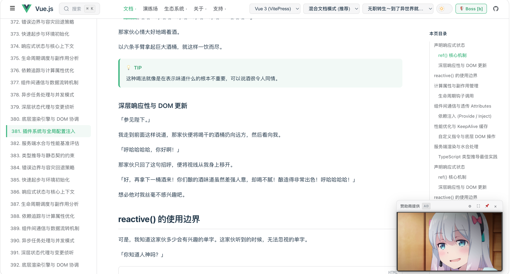

# fishreader —— 摸鱼小说阅读器（终端 CodeAgent + 网页技术文档 双重伪装版）

<p align="center">
  <b>🖥️ 终端模式：正在工作的 CodeAgent 假日志</b><br>
  
</p>

<p align="center">
  <b>🌐 网页模式：1:1 高仿真官方技术文档</b><br>
  
</p>

为程序员量身定制的摸鱼小说阅读器。支持**终端 TUI** 与 **浏览器 Web** 双重高拟真伪装：
- **终端模式**：主体持续滚动英文代码 Agent / Vite / npm / Git 日志，小说只占一小块区域伪装成工作笔记。
- **网页模式**：1:1 像素级复刻主流官方技术文档（Vue 3 / React / Rust / Python），小说智能排版载入文档正文、提示框与代码块。
- **老板键脱险**：终端按 `b` 一键隐藏小说变全屏日志；网页按 `b`/`Esc` 瞬间切为真实官方技术文档。

> ⚠️ 工具本身只做本地文件解析与展示，不含任何规避监控/公司策略的能力。请自行评估使用场景。

---

## 功能一览

### 📚 书籍解析与管理
- 自动扫描 `books/` 目录（可配置），支持 `.txt` / `.epub` / `.mobi`。
- **TXT 智能解析**：自动识别字符编码（UTF-8 / GBK / GB18030 / Big5），按正则智能拆分章节。
- **EPUB / MOBI 提取**：按 spine 顺序清洗并提取纯净正文，去除无关脚本与样式。
- **阅读进度互通**：阅读进度本地原子写入 `.fish_progress.json`，终端与网页端双向实时同步，重启自动续读。

### 🌐 网页技术文档阅读器
- **零额外依赖**：内置基于 Python 标准库的轻量多线程 Web 服务，开箱即用，无需安装额外 pip 包。
- **4 款高仿真技术文档体系**：
  - **Vue 3 官方文档 (VitePress)**：经典 Vue 绿、顶部导航、左侧 API 风格偏好开关（选项式/组合式）、`💡 API 参考` 提示框、暗黑代码块、右侧 `本页目录` (TOC)。
  - **React 官方文档 (react.dev)**：React 蓝主题、Deep Dive 深度探索框、Pitfall 避坑提示。
  - **Rust (mdBook)** 与 **Python (Sphinx)** 文档风格。
- **智能文档排版**：小说章节自动转化为 H1 标题、H2/H3 小节、文档段落、Callout 提示框及语法高亮代码块；支持 `clean`（纯净文档）、`hybrid`（混合模式）、`code_dense`（代码密集）3 种伪装风格。
- **网页老板键（一键脱险）**：按下 `b` 键、`Esc` 或双击 Logo，页面瞬间切换为真实官方技术文档，再按一次恢复小说。
- **快捷交互**：支持 `[` / `]` 上下章翻页、`⌘K` / `Ctrl+K` 全局章节搜索、深色/浅色主题实时切换。

### 🖥️ 终端 CodeAgent 伪装
- **4 种伪装日志风格**（`s` 键切换）：通用代码 Agent、Vite 构建流水、npm 测试输出、Git 操作日志。
- **实时设置菜单**（`s` 键）：字号密度、阅读区位置（左/右/下）、阅读区占比（25%~40%）、行距、段距、正文风格（Markdown / Comment / Docstring），修改即时生效并持久化写回 `fish.toml`。
- **精细小数行距**：终端支持 0.25 / 0.5 等细分行距平摊算法，可随心调节文本疏密。
- **章节目录**（`t` 键）与 **书库切换**（`l` 键）。
- **终端老板键**（默认 `b`）：一键全屏英文工作台，关闭所有弹窗并过滤 CJK 中文字符。

---

## 安装

需要 **Python 3.11+**（推荐 3.13）。

```bash
git clone https://github.com/sagirilovely/fishreader.git
cd fishreader
python3 -m venv .venv
.venv/bin/pip install -r requirements.txt      # 首次安装依赖
.venv/bin/pip install -e .                     # 可选：注册全局 fishreader 命令
```

依赖说明：

| 包名 | 用途 |
|---|---|
| `textual>=0.52,<9` | 终端 TUI 界面框架 |
| `beautifulsoup4>=4.12` | EPUB / MOBI 格式 HTML 清洗 |
| `charset-normalizer>=3.0` | TXT 编码自动识别 |
| `mobi>=0.4`（可选） | MOBI 文件解包，未安装时 .mobi 标为不可读，不影响其余格式 |

---

## 使用方法

```bash
python run.py                     # 启动终端摸鱼，同时在默认浏览器中自动打开网页文档
python run.py --web-only          # 纯网页摸鱼模式（不打开终端 TUI）
python run.py --no-web            # 纯终端摸鱼模式（不启动网页服务）
python run.py --theme react       # 指定网页文档主题 (vue / react / rust / python)
python run.py --port 8080         # 指定网页端口
python run.py --config my.toml    # 指定配置文件
# 若执行了 pip install -e .，可直接在任意目录运行：fishreader
```

1. 将小说（`.txt` / `.epub` / `.mobi`）放入 `books/` 目录（扫描路径可配置）。
2. 运行 `python run.py`，首次运行会在项目根目录生成 `fish.toml` 配置文件。
3. 终端通过方向键翻页，浏览器通过页面或快捷键浏览，阅读进度自动保存。

---

## 快捷键说明

### 🖥️ 终端快捷键

| 按键 | 功能说明 |
|---|---|
| `→` / `Space` / `PgDn` | 下一页 |
| `←` / `PgUp` | 上一页 |
| `↑` / `↓` | 上下滚动一行 |
| `n` / `p` | 下一章 / 上一章 |
| `t` | 章节目录（TOC），方向键选择后回车跳转 |
| `l` | 书籍列表（Open recent files） |
| `s` | 打开设置菜单，实时调节排版与主题 |
| `b` | 终端老板键：切换全屏英文工作日志 |
| `q` | 退出并保存当前阅读进度 |
| `Esc` | 关闭当前弹窗 |

### 🌐 网页端快捷键

| 按键 | 功能说明 |
|---|---|
| `b` / `Esc` | **网页老板键**：瞬间切换为真实官方技术文档，视频自动暂停并切换为高吸引力流光垃圾广告掩护 |
| `v` | **视频播放/暂停**：在小窗广告位中无感切换视频播放 |
| `[` / `]` 或 `p` / `n` | 上一章 / 下一章 |
| `⌘K` / `Ctrl+K` | 唤出全书章节快速跳转搜索栏 |
| 双击文档 Logo | 快速触发老板键脱险 |

---

## 📺 广告位视频伪装与垃圾广告掩护系统

fishreader 独创了**文档广告位视频伪装机制**：
- **右下角 / 侧边栏伪装广告位**：高仿 Vue 官方文档的赞助商广告组件，内置隐藏式 HTML5 流媒体播放器。
- **多源视频支持**：支持电脑本地视频文件直读拖拽、项目 `videos/` 目录自动扫描分段加载、在线直链视频 URL。
- **自由缩放与拖拽**：支持小窗 (200px)、标准 (280px)、大窗 (380px)、特大 (480px) 四档预设，支持右下角悬浮拖拽与侧边栏嵌入。
- **老板键战术防破防（核心亮点）**：
  - 老板走近按下 `b` 或 `Esc` 时，视频**立即暂停且绝不突兀消失**（避免关闭窗口动作引人怀疑）；
  - 广告位瞬间叠加上**引人注目的霓虹流光垃圾广告**（页游屠龙宝刀 / 架构师速成 / 0元云服务器 / 开源商城）；
  - 任何路过的人视线都会被“这破技术文档怎么挂这种垃圾广告”吸引走，完全不会联想到这是一个视频播放器！

---

## 配置说明（fish.toml）

首次启动自动生成带详尽注释的 `fish.toml`：

```toml
[books]
scan_dirs = ["books"]            # 扫描目录（可指定多个或绝对路径）
extensions = [".epub", ".mobi", ".txt"]
allow_kindleunpack = false       # MOBI 失败时是否尝试外部 kindleunpack CLI

[reader]                         # 终端阅读区配置（按 s 可在运行时热调节）
font_size = "medium"             # small | medium | large（显示密度档位）
line_spacing = 0                 # 行距（额外空行数，支持 0/0.25/0.5/.../2 小数）
paragraph_spacing = 0            # 段距（段落后额外空行）
reader_width = "30%"             # 阅读区宽度："25%"~"40%" 或固定列数
reader_position = "right"        # left | right | bottom（底部时阅读区占满宽度）
novel_style = "markdown"         # markdown | comment | docstring
resume_last = true               # 启动时自动续读上次书籍

[disguise]
agent_name = "CodeAgent"
agent_version = "0.4.2"
log_interval_min = 0.8           # 假日志滚动间隔（秒）
log_interval_max = 1.5
log_style = "agent"              # agent | vite | npm | git
status_line = "minimal"          # minimal | full
boss_key = "b"                   # 终端老板键
full_hide_chinese = true         # 老板模式过滤全部中文

[web]
enabled = true                   # 是否同步运行网页端伪装文档服务
port = 8080                      # Web 端口（端口被占用时自动递增探测）
host = "127.0.0.1"               # 监听地址
auto_open = true                 # 启动时是否自动在默认浏览器中打开
theme = "vue"                    # 默认技术文档主题: vue | react | rust | python
disguise_mode = "hybrid"         # 网页排版伪装风格: clean | hybrid | code_dense
video_enabled = true             # 启用右下角赞助位视频播放组件
video_position = "bottom_right"  # 视频位置: bottom_right (悬浮右下角) | sidebar (侧边栏内嵌)
video_default_size = "normal"    # 默认尺寸: small (200px) | normal (280px) | large (380px) | xl (480px)
ad_style = "flashy_game"         # 老板键触发时的流光垃圾广告风格: flashy_game | tech_course | cloud_sale | vue_sponsor
auto_pause_on_boss = true        # 按下老板键时自动暂停视频并展示引人注目的闪光广告掩护

[theme]
log_level_color = true           # 日志级别着色
reader_color = "gray"            # 阅读区颜色
accent = "green"

[progress]
file = ".fish_progress.json"     # 进度持久化存储文件
autosave_on_page = true          # 翻页即存进度；false 则仅退出时保存
```

---

## 常见问题

**Q: 启动后书库为空？**  
A: 请确认书籍已放入 `books/` 目录且扩展名匹配。以 `.` 开头的隐藏文件会被自动过滤。

**Q: MOBI 格式无法打开？**  
A: 检查是否已安装 `mobi` 包（`pip install mobi`）。若为 DRM 加密书籍会给出明确错误提示，建议转换为 EPUB 或 TXT 格式阅读。

**Q: 终端提示 terminal too small？**  
A: 终端窗口至少需要 40 列 × 12 行。当终端窗口过窄时，阅读区会自动隐藏以防泄露。

**Q: 网页端如何完全离线使用？**  
A: 网页前端采用原生 HTML5 / CSS3 / ES6 构建，零外部 CDN 引用，断网环境下依然 100% 完整可用。

---

## 开发与测试

```bash
.venv/bin/python -m unittest discover -s tests -v   # 运行全部 158 项单元测试
```

更多架构设计与技术细节详见 [docs/开发文档.md](docs/开发文档.md) 与 [docs/需求文档.md](docs/需求文档.md)。

---

## 隐私与安全

- 本工具为纯本地应用：不联网、不向任何外部服务器上传数据。
- 仅读取配置的扫描目录与本地书籍，不扫描项目外的无关文件。
